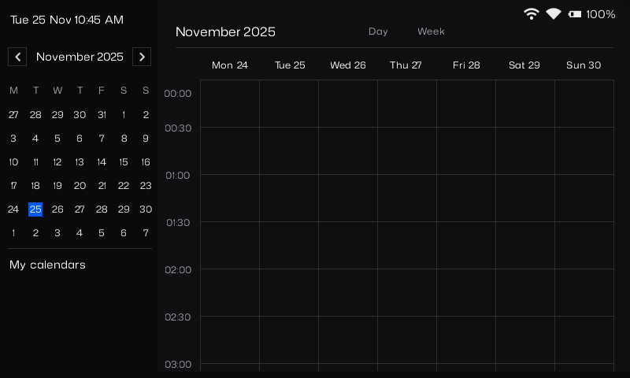

# GRVL Zephyr calendar demo

Copyright (c) 2025 [Antmicro](https://www.antmicro.com)

<picture>
  <!-- User prefers light mode: -->
  <source srcset="images/grvl_logo_black.png" media="(prefers-color-scheme: light)"/>

  <!-- User prefers dark mode: -->
  <source srcset="images/grvl_logo_white.png"  media="(prefers-color-scheme: dark)"/>

  <!-- User has no color preference: -->
  
</picture>

An interactinve calendar demo using [Graphics Rendering Visual Library](https://github.com/antmicro/grvl) and [Zephyr RTOS](https://zephyrproject.org).



## Features

- Interactive buttons
- Scrollable main view
- Animations
- Dynamic content using JavaScript

## Supported boards

- Native simulator (64 bit)
- STM32H747I Discovery (M7 core) + ST B-LCD40-DSI (MB1166-A09) shield

## Quick Start

### Fetching sources

```sh
$ git clone https://github.com/antmicro/grvl-zephyr-calendar-demo
$ cd grvl-zephyr-calendar-demo
$ west init -l .
$ west update
$ west patch apply
```

### Building

```sh
$ west build -b <board>
```

### Flashing

```sh
$ west flash
```

### Running (Native simulator)

```sh
$ ./build/zephyr/zephyr.exe
```

## License
The source code for this project is licensed under [Apache License 2.0](https://www.apache.org/licenses/LICENSE-2.0),
and the fonts are licensed under [SIL Open Font License 1.1](https://openfontlicense.org).
